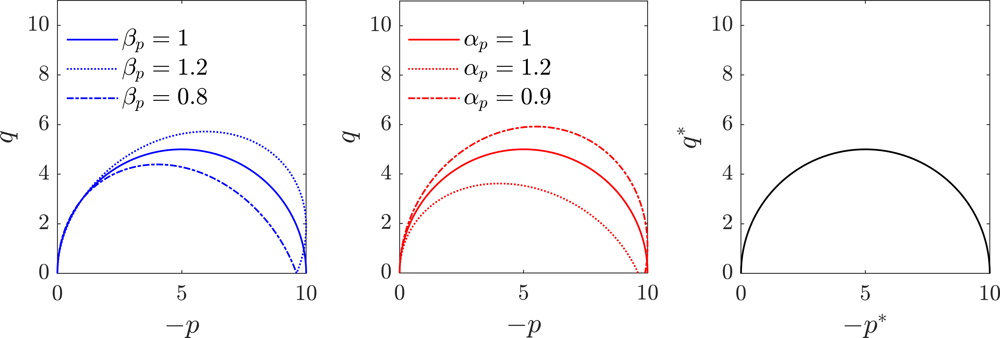

Semnani, S.J., White, J.A., Borja, R.I., 2016. Thermoplasticity and strain localization in transversely isotropic materials based on anisotropic critical state plasticity. Int. J. Numer. Anal. Methods Geomech. 40, 2423–2449. https://doi.org/10.1002/nag.2536

The code plots the AMCC yield surface in both original and fictitious stress spaces, despite we cannot reach a good match. 

