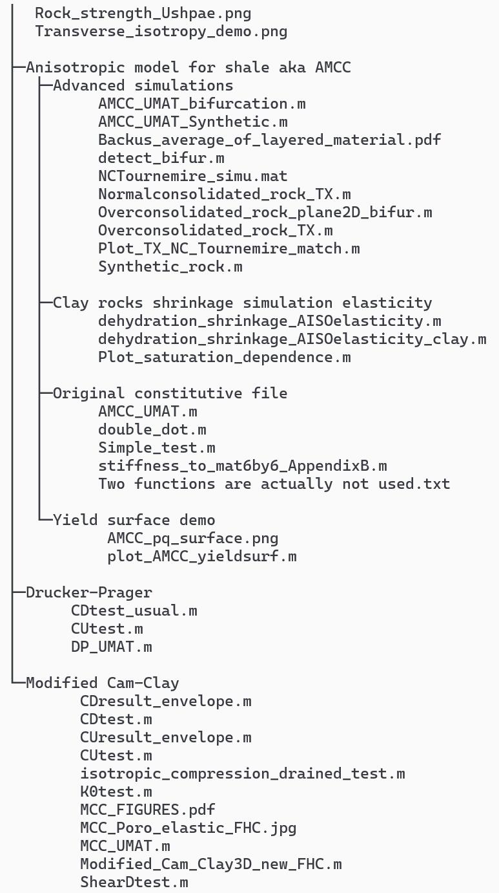

This repository summarized several elastoplastic constitutive models, which are given in the time-integrated fully implicit form. Some classical stresss point simulations are also provided. A detailed directory tree diagram is shown as follows, which suggests that these constitutive models are considered: (1) ideal Drucker-Prager plasticity; (2) Modified Cam-Clay in which the isotropic elastic matrix is updated explicitly; (3) anisotropic MCC model for transversely isotropic rocks such as shale; (4) saturation-dependent anisotropic elasticity.

A non-comprehensive theoretical reference could be found [here](https://qizhang94.github.io/assets/files/Shared_1.pdf). If you have any questions, you could send an email to qizhang01 of outlook mailbox.

